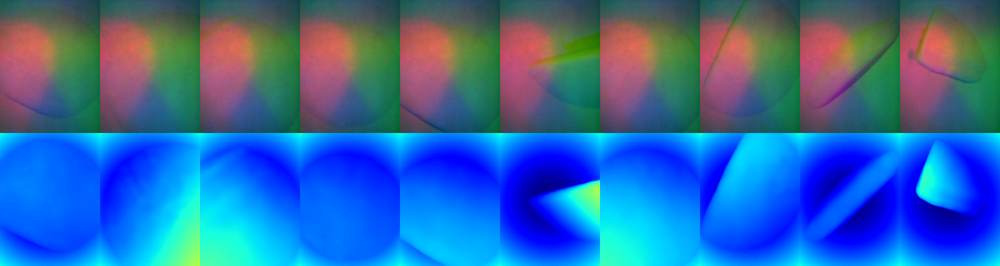

## Tactile transformer: vision-based touch to depth

https://github.com/user-attachments/assets/148ec457-d9d1-415f-887f-73ebed8a568b

While vision-based touch sensors interpret contact geometry as images, they remain out-of-distribution from natural images. The embedded camera directly perceives the illuminated gelpad, and contact depth is either obtained via photometric stereo, or supervised learning. Existing touch-to-depth relies on convolution, however recent work has shown the benefit of a ViT for dense depth prediction in natural images. We present a tactile transformer for predicting contact depth from vision-based touch, trained entirely in simulation to generalize across multiple real-world DIGIT sensors. For use, refer to the [NeuralFeels](https://github.com/facebookresearch/neuralfeels) repository.

Our code is based on [FocusOnDepth](https://github.com/antocad/FocusOnDepth), a re-implementation of the popular [DPT](https://github.com/isl-org/DPT) vision transformer. We make necessary modification to work for tactile images, and share the weights online. The models `data/tactile_transformer/dpt_real.p` and `data/tactile_transformer/dpt_sim.p` are trained on TACTO data from simulated interaction with YCB objects. The models differ slightly in the augmentations used during data generation. 

## Example script



*Tactile transformer depth outputs (colormapped) for simulated data from interaction with YCB objects.*

First download tactile data from `YCB` objects: 
```bash
cd data 
gdown https://drive.google.com/drive/folders/1a-8vfMCkW52BpWOPfqk5WM5zsSjBfhN1?usp=sharing --folder
mv sim tacto_data
cd tacto_data && unzip -q '*.zip' && rm *.zip
cd ../..
```

Run the test script
```bash
python neuralfeels/contrib/tactile_transformer/touch_vit.py
```

## Citation

If you find NeuralFeels useful in your research, please consider citing our paper:

```bibtex
@article{suresh2024neuralfeels,
  title={{N}eural feels with neural fields: {V}isuo-tactile perception for in-hand manipulation},
  author={Suresh, Sudharshan and Qi, Haozhi and Wu, Tingfan and Fan, Taosha and Pineda, Luis and Lambeta, Mike and Malik, Jitendra and Kalakrishnan, Mrinal and Calandra, Roberto and Kaess, Michael and Ortiz, Joseph and Mukadam, Mustafa},
  journal={Science Robotics},
  pages={adl0628},
  year={2024},
  publisher={American Association for the Advancement of Science}
}
```
